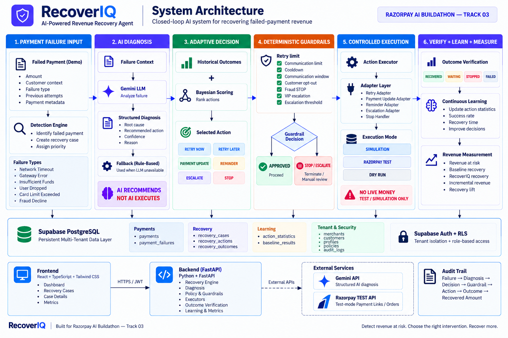

# RecoverIQ

> **Adaptive AI Revenue Recovery Agent for Failed & Degraded Digital Payments**  
> *Razorpay AI Buildathon — Track 03: AI Revenue Recovery*

[](https://github.com/Nakshathra-2808/recoveriq/actions)
[](https://github.com/Nakshathra-2808/recoveriq)
[](https://github.com/Nakshathra-2808/recoveriq)
[](https://github.com/Nakshathra-2808/recoveriq)
[](https://github.com/Nakshathra-2808/recoveriq)

---

## 1. Project Title
**RecoverIQ** — Adaptive AI Revenue Recovery Agent

## 2. One-Line Description
A closed-loop AI agent that detects failed payments, diagnoses failure root causes, selects optimal recovery actions via Bayesian decision scoring, enforces deterministic safety guardrails, and measures incremental revenue recovered over standard retry baselines.

---

## 3. Problem
In digital commerce, 5% to 15% of payment transactions fail due to transient network drops, bank downtimes, insufficient funds, expired instruments, or user drop-offs.

Standard recovery practices suffer from two major flaws:
1. **Dumb, Naive Retries**: Merchants blindly hammer payment gateways with immediate retries, worsening bank throttling, increasing processing fees, and annoying customers.
2. **One-Size-Fits-All Logic**: Hardcoded if-else trees fail to adapt when bank degradation worsens or when specific payment instruments (e.g., UPI vs Cards) require distinct intervention timelines.

Without intelligent diagnosis and dynamic action selection, merchants lose recoverable revenue while having zero visibility into true incremental lift versus naive retries.

---

## 4. Solution
**RecoverIQ** replaces static retry rules with a multi-stage, closed-loop AI recovery engine:
- **Intelligent Ingestion & Diagnosis**: Ingests failure telemetry, categorizes error types, and leverages an LLM-powered diagnostic layer (with a reliable deterministic fallback) to generate human-readable technical explanations.
- **Adaptive Action Selection**: Uses Bayesian posterior scoring over historical outcome statistics to choose the highest-probability recovery action.
- **Deterministic Server-Side Guardrails**: Hard safety boundary enforcing strict retry caps, communication cooldowns, fraud aborts, and VIP escalations before any action can execute.
- **Incremental Value Measurement**: Benchmarks recovered amounts against a standard Naive Retry Baseline to quantify true incremental revenue lift ($₹$).

---

## 5. Recovery Pipeline
RecoverIQ executes every recovery case through a strict 9-stage closed loop:

$$\text{DETECT} \longrightarrow \text{DIAGNOSE} \longrightarrow \text{CHOOSE} \longrightarrow \text{GUARD} \longrightarrow \text{EXECUTE} \longrightarrow \text{VERIFY} \longrightarrow \text{LEARN} \longrightarrow \text{AUDIT} \longrightarrow \text{MEASURE}$$

```
 1. DETECT    ──> Ingest failure event, validate tenant, calculate Revenue at Risk
 2. DIAGNOSE  ──> LLM / Rule-based root-cause diagnosis & technical explanation
 3. CHOOSE    ──> Bayesian adaptive policy selects candidate recovery action
 4. GUARD     ──> Deterministic safety rules validate/override/block candidate action
 5. EXECUTE   ──> Controlled execution via Sandbox/Test Adapters (Simulation / Razorpay Test)
 6. VERIFY    ──> Classify outcome (RECOVERED, RETRYABLE, FAILED)
 7. LEARN     ──> Update action statistics in real-time, refining Bayesian priors
 8. AUDIT     ──> Record immutable step-by-step audit trail event in PostgreSQL
 9. MEASURE   ──> Compute RecoverIQ vs Naive Baseline recovery & incremental lift (₹)
```

---

## 6. Architecture



### Key Architectural Invariants
- **Multi-Tenant Isolation**: Row Level Security (RLS) policies at the PostgreSQL database layer enforce absolute tenant data segregation by `merchant_id`.
- **Stateless Backend**: FastAPI modular architecture validating Supabase JWTs via asymmetric JWKS / public keys.
- **Safety Boundary**: **AI recommends — deterministic guardrails decide**. The LLM never directly executes payments or mutates database states.

---

## 7. Core Features
- **Multi-Tenant Merchant Portal**: Dedicated dashboard with Supabase Auth, role-based access control, and batch/lifetime filtering.
- **Interactive Recovery Console**: One-click demo batch runner, real-time recovery monitoring, and expandable case inspection modals.
- **AI Diagnosis & Reasoning**: Generates granular root-cause hypotheses, confidence scores, and plain-English recommendations.
- **Adaptive Policy Selection**: Real-time Bayesian action selection prioritizing high-performing recovery strategies.
- **Deterministic Guardrail Protection**: Prevents duplicate charges, gateway hammering, and excessive customer notifications.
- **Multi-Mode Execution Engine**: Isolated adapters for safe simulation, dry-run validation, and Razorpay Test sandbox.
- **Transparent Audit Ledger**: Immutable event trail capturing every diagnosis, policy evaluation, guardrail check, and execution response.
- **Baseline Uplift Benchmarking**: Mathematical measurement of RecoverIQ recovery performance versus a naive 3-retry baseline.

---

## 8. Supported Payment Failure Scenarios

| Failure Scenario | Error Code / Category | Typical Root Cause | Recommended Strategy |
| :--- | :--- | :--- | :--- |
| **Network Timeout** | `GATEWAY_TIMEOUT` / `NETWORK_ERROR` | Transient gateway handshake failure | Immediate or quick retry (`RETRY_NOW`) |
| **Gateway Degradation** | `GATEWAY_ERROR` / `503_SERVICE_UNAVAILABLE` | Downstream bank/switch downtime | Scheduled cooldown retry (`RETRY_LATER`) |
| **Insufficient Funds** | `INSUFFICIENT_FUNDS` / `LOW_BALANCE` | Customer balance shortfall | Nudge buyer or retry after salary window (`REMINDER` / `RETRY_LATER`) |
| **User Drop-Off** | `USER_DROPPED` / `AUTH_CANCELLED` | OTP abandonment or session expiry | Contextual reminder nudge (`REMINDER`) |
| **Limit Exceeded** | `CARD_LIMIT_EXCEEDED` / `LIMIT_BREACH` | Daily or transaction ceiling hit | Send alternative payment method link (`PAYMENT_UPDATE`) |
| **Suspected Fraud** | `FRAUD_DECLINE` / `RISK_REJECTED` | Security flag or blacklisted instrument | Immediate abort (`STOP`) to protect merchant |

---

## 9. Adaptive Decisioning & Bayesian Action Scoring

RecoverIQ avoids hardcoded if-else logic by implementing a **Beta-Binomial Bayesian Updating Model** over historical intervention outcomes for each `(failure_reason, action_type)` pair.

### Scoring Formula
$$\text{Expected Value Score} = \frac{\text{Successes} + \alpha}{\text{Total Attempts} + \alpha + \beta} \times \text{Action Preference Weight}$$

- **Prior Hyperparameters**: $\alpha = 1.0$, $\beta = 1.0$ (Laplace smoothing ensuring unexplored actions have positive exploration probability).
- **Online Learning**: As recovery actions succeed or fail, `action_statistics` rows are updated in Supabase, dynamically steering future decisions toward the highest-yielding recovery channel.

### Supported Action Space
- `RETRY_NOW`: Immediate retry for transient drops.
- `RETRY_LATER`: Scheduled retry with exponential cooldown for bank degradation.
- `PAYMENT_UPDATE`: Payment link sent to buyer to switch payment instruments.
- `REMINDER`: Contextual notification/nudge.
- `ESCALATE`: Flagged for manual merchant intervention for high-value VIP orders.
- `STOP`: Absolute terminal state to prevent over-retrying or duplicate charges.

---

## 10. AI Diagnosis & Reasoning

RecoverIQ features a **dual-path diagnostic architecture**:

1. **Primary AI Path (Gemini 2.5 API)**:
   - Evaluates error telemetry, transaction amount, customer tier, retry count, and gateway response.
   - Prompts the LLM with strict JSON schema output requirements.
   - Produces root-cause classification, technical explanation, confidence score ($0.0 - 1.0$), and recommended recovery strategy.
2. **Deterministic Fallback Path**:
   - If the API key is unconfigured, rate-limited, or times out, the engine seamlessly switches to a rule-based diagnostic matrix without pipeline interruption.
3. **Safety Guarantee**:
   - AI outputs are strictly treated as **diagnostic advice**. Candidate actions must pass through the Bayesian Policy Engine and Deterministic Guardrails before any execution occurs.

---

## 11. Deterministic Safety Guardrails

To guarantee safety in production financial workflows, deterministic guardrails enforce hard rules that **override or block** AI suggestions:

```
Candidate Action ──> [ Guardrail Evaluation ]
                           ├── Max Retries Exceeded? (>= 3)       ──> FORCE STOP
                           ├── Max Communications Exceeded? (>= 2)──> FORCE STOP
                           ├── Retry In Cooldown Window?          ──> BLOCK / DELAY
                           ├── Customer Opted Out / Blocked?      ──> FORCE STOP
                           ├── Suspected Fraud / Risk Decline?    ──> FORCE STOP (No Retry)
                           └── High-Value VIP Transaction?        ──> ESCALATE to Merchant
```

- **Invariants**: No customer receives more than 2 nudges; no failed payment is retried more than 3 times; fraud declines are never retried.

---

## 12. Execution Modes

RecoverIQ supports three safe, isolated execution modes configured via `RECOVERY_EXECUTION_MODE`:

| Execution Mode | Target | Description | Real Money Involved? |
| :--- | :--- | :--- | :--- |
| **`SIMULATION`** *(Default)* | Internal Mock Engine | Simulates gateway latencies, success rates, and customer responses using synthetic telemetry. | **NO (Zero Real Money)** |
| **`DRY_RUN`** | Diagnostic Sandbox | Generates full diagnosis, Bayesian scoring, and guardrail validation but skips adapter execution. | **NO (Zero Real Money)** |
| **`RAZORPAY_TEST`** | Razorpay Sandbox API | Dispatches test orders and payment links against the official Razorpay Test/Sandbox environment using test credentials. | **NO (Test Sandbox Only)** |

> **Safety Notice**: RecoverIQ is strictly designed for test and simulation environments. It does **not** process real customer card data or real-money financial transactions.

---

## 13. Baseline vs. RecoverIQ Measurement

To prove business value, every batch execution is benchmarked against a **Naive Baseline Model** (representing standard merchant behavior: 3 immediate blind retries with no adaptive routing or customer outreach).

### Metric Calculations
- **Revenue at Risk**: Total $₹$ amount of all failed transactions in the batch.
- **RecoverIQ Recovered**: Total $₹$ amount successfully recovered by RecoverIQ's adaptive actions.
- **Naive Baseline Recovered**: Simulated recovery $₹$ from standard naive retries.
- **Incremental Revenue**:
  $$\text{Incremental Revenue} = \text{RecoverIQ Recovered} - \text{Naive Baseline Recovered}$$
- **Recovery Lift**:
  $$\text{Recovery Lift (\%)} = \frac{\text{RecoverIQ Recovered} - \text{Naive Baseline Recovered}}{\text{Naive Baseline Recovered}} \times 100$$

---

## 14. Audit Trail

Every recovery lifecycle transition creates an immutable audit log entry in the PostgreSQL `audit_logs` table:
- **`step_name`**: Stage in the 9-step pipeline (`INGESTION`, `DIAGNOSIS`, `POLICY_EVALUATION`, `GUARDRAIL_CHECK`, `EXECUTION`, `VERIFICATION`, `LEARNING`).
- **`input_payload`**: Captured input parameters and context.
- **`output_payload`**: Resulting decisions, confidence scores, and adapter responses.
- **`execution_status`**: `SUCCESS`, `OVERRIDDEN`, `REJECTED`, or `FAILED`.
- **`merchant_id` & `timestamp`**: Tenant ownership and ISO timestamp for full compliance.

---

## 15. Tech Stack

- **Frontend**: React 18, TypeScript, Tailwind CSS, Lucide React, Vite, Vitest
- **Backend**: Python 3.11+, FastAPI, Pydantic v2, Pytest, HTTPX, Supabase Python Client
- **AI / LLM**: Google Gemini 2.5 API (Structured JSON output with deterministic fallback)
- **Database & Auth**: Supabase PostgreSQL 15, Row Level Security (RLS), Supabase Auth (JWT with JWKS asymmetric key verification)
- **Payment Sandbox**: Razorpay Test API

---

## 16. Project Structure

```
recoveriq/
├── backend/
│   ├── app/
│   │   ├── api/v1/endpoints/   # API routes: health, auth, recovery
│   │   ├── auth/               # Supabase JWT & JWKS asymmetric verification
│   │   ├── core/               # Settings, configuration & environment
│   │   ├── models/             # Pydantic data schemas & enums
│   │   ├── services/
│   │   │   ├── adapters/       # Simulation & Razorpay Test adapters
│   │   │   ├── ai_diagnosis.py # LLM diagnosis with deterministic fallback
│   │   │   ├── baseline_engine.py # Naive retry baseline calculation
│   │   │   ├── executor_service.py# Controlled action dispatcher
│   │   │   ├── guardrail_service.py # Deterministic safety rules
│   │   │   ├── policy_engine.py# Bayesian adaptive action scoring
│   │   │   ├── recovery_engine.py # End-to-end recovery pipeline orchestrator
│   │   │   ├── supabase_db.py  # Data access layer with retry & backoff
│   │   │   └── synthetic_data.py # Idempotent demo batch generation
│   │   └── main.py             # FastAPI entrypoint
│   ├── tests/                  # 64 passing pytest tests
│   └── requirements.txt        # Backend dependencies
│
├── frontend/
│   ├── src/
│   │   ├── auth/               # Supabase authentication context
│   │   ├── components/         # Metric cards, cases table, modal, banners
│   │   ├── pages/              # Recovery Dashboard & Login pages
│   │   ├── services/           # Backend API client with JWT interceptor
│   │   └── types/              # TypeScript domain interfaces
│   ├── tests/                  # 10 passing Vitest unit tests
│   ├── package.json            # Node.js dependencies
│   └── vite.config.ts          # Vite bundler configuration
│
├── supabase/
│   ├── migrations/             # Relational SQL schema & RLS policies
│   └── seed/                   # Seed data for demo merchants
│
├── docs/
│   └── recoveriq-architecture.png # System architecture diagram
│
├── .github/workflows/ci.yml    # Continuous Integration pipeline
├── README.md                   # Project documentation
└── docker-compose.yml          # Local container configuration
```

---

## 17. Local Development

### Prerequisites
- Node.js 18+ and npm
- Python 3.11+
- Free Supabase project (or local Supabase instance)

### 1. Database Setup (Supabase)
Execute the SQL migration files in `supabase/migrations/` via the Supabase SQL Editor to provision tables and RLS security policies.

### 2. Backend Setup
```bash
cd backend
python -m venv .venv

# On Windows:
.venv\Scripts\activate
# On Linux/macOS:
source .venv/bin/activate

pip install -r requirements.txt
cp .env.example .env

# Configure .env with your SUPABASE_URL, SUPABASE_KEY, and optional GEMINI_API_KEY
uvicorn app.main:app --reload --host 0.0.0.0 --port 8000
```
- API Docs: `http://localhost:8000/api/v1/docs`
- Health Check: `http://localhost:8000/health`

### 3. Frontend Setup
```bash
cd frontend
npm install
cp .env.example .env

# Configure .env with VITE_SUPABASE_URL, VITE_SUPABASE_ANON_KEY, VITE_API_BASE_URL
npm run dev
```
- Web Application: `http://localhost:5173`

---

## 18. Testing & Verification

RecoverIQ maintains strict test coverage across all layers of the stack:

```bash
# 1. Run Backend Test Suite (64 Tests)
cd backend
pytest -v

# 2. Run Frontend Test Suite (10 Tests)
cd frontend
npm test -- --run

# 3. Verify Production Frontend Build
npm run build
```

### Verified Test Status
- **Backend**: **64 / 64 unit and integration tests passing** (`pytest`)
  - AI diagnosis & fallback paths (`test_ai_diagnosis.py`)
  - JWT auth & tenant isolation (`test_auth.py`)
  - Health & router configuration (`test_health.py`)
  - Razorpay Test adapter handling (`test_razorpay_adapter.py`)
  - Bayesian scoring & guardrail invariants (`test_recovery_engine.py`)
  - Multi-tenant SQL RLS validation (`test_rls_sql.py`)
- **Frontend**: **10 / 10 tests passing** (`Vitest`)
- **Production Build**: Passing with clean TypeScript compilation (`tsc && vite build`)

---

## 19. Demo Walkthrough

1. **Login**: Access the web portal at `http://localhost:5173` and log in with your merchant credentials.
2. **Run Demo Recovery**: Click the **"Run Demo Recovery"** button on the console header.
3. **Pipeline Ingestion**: A synthetic batch of 6 realistic failed payments across diverse failure scenarios is seeded idempotently.
4. **Autonomous Recovery**:
   - The AI engine diagnoses each failure root cause.
   - The Bayesian policy evaluates optimal candidate actions.
   - Guardrails inspect and authorize each action.
   - Adapters execute interventions in simulation mode.
5. **Inspect Outcomes**:
   - View the **Latest Batch Success Banner** showcasing transactions processed, recovery rate, and baseline lift.
   - Compare **Total Recovered vs. Naive Baseline** in the revenue metrics cards.
   - Click **"View Details"** on any case to inspect the AI reasoning, guardrail status, and step-by-step audit log.

---

## 20. Deployment Configuration

RecoverIQ is architected as a cloud-ready Twelve-Factor application:
- **Frontend**: Deployable as a static SPA on Vercel, Netlify, or Cloudflare Pages.
- **Backend**: Deployable as a containerized FastAPI service on Render, Fly.io, AWS ECS, or GCP Cloud Run.
- **Database**: Hosted Supabase PostgreSQL instance with managed connection pooling.
- **Secrets Management**: Configured strictly via environment variables (`SUPABASE_URL`, `SUPABASE_SERVICE_ROLE_KEY`, `GEMINI_API_KEY`, `RAZORPAY_KEY_ID`, `RAZORPAY_KEY_SECRET`).

---

## 21. What Broke and How We Fixed It

During the iterative build process, several real-world edge cases were identified and systematically resolved:

1. **Duplicate Customer Creation During Repeated Demo Seeding**:
   - *Issue*: Repeatedly clicking "Run Demo Recovery" caused unique constraint violations (`uq_customers_merchant_external`) on synthetic customer IDs.
   - *Fix*: Refactored `synthetic_data.py` and `supabase_db.py` to make synthetic customer and payment seeding fully **idempotent** using upsert logic and timestamped external reference keys.
2. **Transient Supabase REST Connection Timeouts**:
   - *Issue*: High-concurrency batch insertions occasionally encountered network latency and HTTP connect timeouts against remote Supabase REST endpoints.
   - *Fix*: Added bounded retry loops with exponential backoff and jitter in `supabase_db.py`, combined with explicit connection timeouts to ensure bulletproof database persistence.
3. **Supabase Asymmetric JWT Verification**:
   - *Issue*: Supabase Auth migrated to asymmetric signing keys (`ES256`/`RS256`), causing traditional symmetric HMAC secret verification to fail.
   - *Fix*: Implemented dynamic **JWKS (JSON Web Key Set)** fetching and public key verification in `backend/app/auth/jwt.py` with in-memory key caching.

---

## 22. Future Scope

- **Real-Time Webhook Gateway**: Ingest live webhook events directly from production payment gateways.
- **Multi-Channel Dispatch**: Expand execution adapters to deliver SMS, WhatsApp, and email payment links via Twilio / SendGrid.
- **Reinforcement Learning with Contextual Bandits**: Upgrade the Bayesian model to contextual bandits that factor in customer lifetime value (LTV), device type, and time-of-day.
- **Automated Bank Downtime Tracker**: Integrate bank health APIs to automatically throttle and schedule `RETRY_LATER` actions during major banking switch outages.

---

## 23. Hackathon Alignment

**Razorpay AI Buildathon — Track 03: AI Revenue Recovery**

- **Direct Problem Focus**: Tackles the core challenge of lost revenue from failed digital payments.
- **Responsible AI Architecture**: Adheres to the principle that **AI recommends, but deterministic guardrails decide** — preventing hallucinations from causing financial harm.
- **Quantifiable Business Value**: Directly measures incremental revenue ($₹$) and lift against standard retry baselines.
- **Production-Grade Engineering**: Complete multi-tenant RLS data security, comprehensive test suite (64 backend + 10 frontend tests), clean TypeScript frontend, and an immutable audit trail.

---

## 24. GitHub Repository

- **Repository**: [https://github.com/Nakshathra-2808/recoveriq](https://github.com/Nakshathra-2808/recoveriq)
- **Author / Team**: Nakshathra
- **License**: MIT
