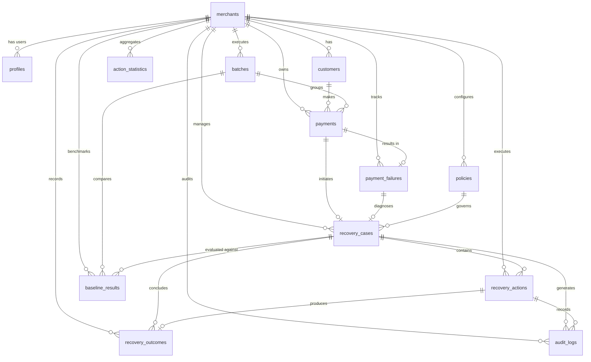

# RecoverIQ Architecture Specification

## Overview
RecoverIQ is an Adaptive AI Revenue Recovery Agent built for Razorpay Track 03. It specializes strictly in recovering failed and degraded payments through root cause diagnosis, adaptive policy selection, deterministic server-side guardrails, verifiable outcome tracking, and continuous learning.

## System Topology (Modular Monolith)

```
[ Merchant Web Console ] (React + TypeScript + Tailwind CSS)
           │
           │ Supabase Auth (JWT) / REST API with Bearer Token
           ▼
[ FastAPI Backend Application ]
    ├── API Layer (/api/v1/auth, /api/v1/recovery)
    ├── Auth & Dependency Layer (JWKS Asymmetric Verification & Merchant Resolution)
    ├── Detection Service (Failure Scanner & Priority Scoring)
    ├── Diagnosis Service (Deterministic Error & Gateway Classification)
    ├── Adaptive Policy Engine (Bayesian Statistical Action Scoring)
    ├── Server-Side Guardrails (Deterministic Safety & Policy Invariants)
    ├── Action Executor (Simulation Mode & Extensible Gateway Adapters)
    ├── Outcome Verifier (Deterministic Lifecycle State Transition)
    ├── Continuous Learning Service (Empirical Action Statistics)
    ├── Baseline Benchmark Service (Standard Fixed Retry Comparison)
    └── Immutable Audit Logger
           │
           │ Service-Role Authenticated PostgREST / PostgreSQL Connection
           ▼
[ Supabase PostgreSQL ] (Multi-Tenant Row Level Security Enforced)
    ├── merchants (Multi-tenant root organization)
    ├── profiles (User identity & role-based access linked to auth.users)
    ├── customers (End customer identity & opt-out preferences)
    ├── batches (Benchmark/batch processing execution groups)
    ├── payments (Payment transaction records without sensitive card/CVV data)
    ├── payment_failures (Root cause diagnostic attributes & classifications)
    ├── policies (Guardrails, limits, cooldowns, and communication windows)
    ├── recovery_cases (V2 State Machine lifecycle tracking)
    ├── recovery_actions (Deterministic & adaptive action execution plans)
    ├── recovery_outcomes (Verifiable recovery outcome tracking)
    ├── action_statistics (Calibrated historical recovery success rates)
    ├── baseline_results (Benchmark comparison vs fixed strategies)
    └── audit_logs (Immutable audit trail of actions, decisions & overrides)
```

## The 9-Stage Recovery Pipeline

```
1. DETECT     ──► Finds unhandled failed transactions, creates `recovery_cases` (DETECTED)
2. DIAGNOSE   ──► Classifies error etiology: NETWORK_TIMEOUT, GATEWAY_ERROR, INSUFFICIENT_FUNDS,
                  USER_DROPPED, CARD_LIMIT_EXCEEDED, FRAUD_DECLINE (DIAGNOSED)
3. CHOOSE     ──► Evaluates candidate actions using Bayesian smoothed historical success rates
                  from `action_statistics` and calibrated priors (DECISION_READY)
4. GUARD      ──► Hardcoded safety invariants: opt-out check, fraud lockout, retry/comm limits,
                  cooldown enforcement, communication windows, VIP auto-escalation (APPROVED/STOPPED)
5. EXECUTE    ──► Dispatches action via adapter (Retry, PaymentUpdate, Reminder, Escalation, Stop)
                  in SIMULATION mode (EXECUTING/COMPLETED)
6. VERIFY     ──► Evaluates verifiable outcome, updates case state: RECOVERED, WAITING, STOPPED, FAILED
7. LEARN      ──► Updates merchant `action_statistics` (attempts, successes, rate, recovery time)
8. AUDIT      ──► Permanently records every transition, decision reasoning, and guardrail check in `audit_logs`
9. MEASURE    ──► Runs baseline standard fixed-retry on identical batch; computes Revenue at Risk,
                  Baseline Recovery, RecoverIQ Recovery, Incremental Revenue, and Recovery Lift %
```

## Authentication & Multi-Tenant Authorization Architecture

### End-to-End Authentication Flow

```
1. React Client ──(email, password)──► Supabase Auth Service
2. Supabase Auth ──(access_token JWT)──► React Client (Persisted Session)
3. React Client ──(Authorization: Bearer <JWT>)──► FastAPI Backend
4. FastAPI Backend ──(JWKS Asymmetric Key & Claim Verification)──► Validated `sub` (User ID)
5. FastAPI Backend ──(Server-Side Lookup via ProfileService)──► Resolved Merchant Organization
6. Supabase DB ──(PostgreSQL RLS with SECURITY DEFINER Helpers)──► Isolated Tenant Records
```

### Identity & Tenancy Resolution Invariant
Client-supplied `merchant_id` values (in headers, query parameters, or payload bodies) are **never trusted as proof of identity**.
The server strictly derives the tenant context from the verified JWT:
```
auth.users.id (JWT 'sub' claim)
    ↓
profiles.id
    ↓
profiles.merchant_id
    ↓
merchants (Target Tenant Organization)
```

### Cryptographic JWT Verification & JWKS Key Discovery
- **Asymmetric Signing Keys (JWKS)**: Modern Supabase projects sign user JWTs using asymmetric cryptography (e.g. `ES256`, `RS256`). The backend dynamically resolves and verifies signing keys using the project's standard JWKS endpoint (`{SUPABASE_URL}/auth/v1/.well-known/jwks.json`).
- **In-Memory JWKS Caching**: Key sets are cached in-memory with a 5-minute TTL (`lifespan=300`) to prevent unnecessary network requests on every authenticated call.
- **Strict Algorithm Whitelist**: Verification forbids wildcard matching (`algorithms=["*"]`) and disables insecure algorithms (e.g. `none`). Permitted algorithms are strictly restricted to `["ES256", "RS256", "ES384", "RS384", "ES512", "RS512", "HS256"]`.
- **Symmetric Fallback**: If a legacy or local test environment issues symmetric `HS256` tokens with a shared secret, verification falls back securely to `SUPABASE_JWT_SECRET`.
- **Audience & Subject Verification**: Every token must strictly satisfy `aud = "authenticated"`, include a valid `sub` (user UUID), and not be expired (`exp`).

### Role Model (RBAC)
RecoverIQ enforces a strict 4-tier role hierarchy:
1. `owner`: Full organization governance, policy creation, billing, member management, and recovery overrides.
2. `admin`: Policy management, system configuration, member administration, and operational execution.
3. `operator`: Operational read/write access required for recovery workflows, batch processing, and case actions.
4. `viewer`: Strictly read-only access to dashboards, metrics, and audit records.

### Service-Role Key Confinement
- **Frontend**: Only receives `VITE_SUPABASE_URL` and `VITE_SUPABASE_ANON_KEY`.
- **Backend**: Holds the privileged `SUPABASE_SERVICE_ROLE_KEY` and `SUPABASE_JWT_SECRET`. Privileged server operations bypass RLS only when executing verified backend services on behalf of authenticated and authorized tenants.

## Database Entity Relationships



## Row-Level Security (RLS) Tenant Isolation

Every application table is protected by PostgreSQL RLS policies defined in `supabase/migrations/20260828000000_stage2b_tenant_rls_policies.sql`.
- **Security Definer Helpers**: `public.get_auth_merchant_id()` and `public.get_auth_user_role()` eliminate recursive RLS execution and securely map `auth.uid()` to the active merchant profile.
- **Tenant Boundary**: Every SELECT query enforces `merchant_id = public.get_auth_merchant_id()`.
- **Role Boundary**: Mutation queries (INSERT/UPDATE) require `public.is_merchant_operator_or_above(merchant_id)` or `public.is_merchant_admin_or_owner(merchant_id)`.
- **Audit Immutability**: `audit_logs` has no UPDATE or DELETE policies.

## Core Recovery Actions & Execution Modes

### Action Types
1. `RETRY_NOW` — Immediate transient error retry (e.g., network glitch, momentary gateway timeout).
2. `RETRY_LATER` — Scheduled retry after gateway degradation or banking system cooldown.
3. `PAYMENT_UPDATE` — Prompt customer with smart fallback links (e.g. switch from failed NetBanking to UPI / Card).
4. `REMINDER` — Respectful customer notification sent via preferred communication channel within allowed windows.
5. `ESCALATE` — Flag for high-value manual merchant intervention and account manager review.
6. `STOP` — Explicit terminal state to prevent customer harassment, duplicate charges, or fraud retry.

### Execution Modes
- `RAZORPAY_TEST` — Integration testing against Razorpay Test mode API.
- `SIMULATION` — Controlled sandbox environment for high-throughput policy testing and deterministic outcome verification.
- `DRY_RUN` — Evaluates policies and guardrails without triggering external adapter dispatch.

## Recovery Case Lifecycle (V2 State Machine)

```
[ DETECTED ] ──► [ DIAGNOSED ] ──► [ DECISION_READY ] ──► [ APPROVED ]
                                                              │
   ┌──────────────────────────────────────────────────────────┴───────────────┐
   ▼                                                                          ▼
[ EXECUTING ] ──► [ WAITING ] ──► [ RECOVERED ] (Terminal Success)      [ ESCALATED ]
   │                 │
   │                 ├──► [ STOPPED ] (Terminal Guardrail)
   │                 │
   └─────────────────┴──► [ FAILED ] (Terminal Failure)
```
