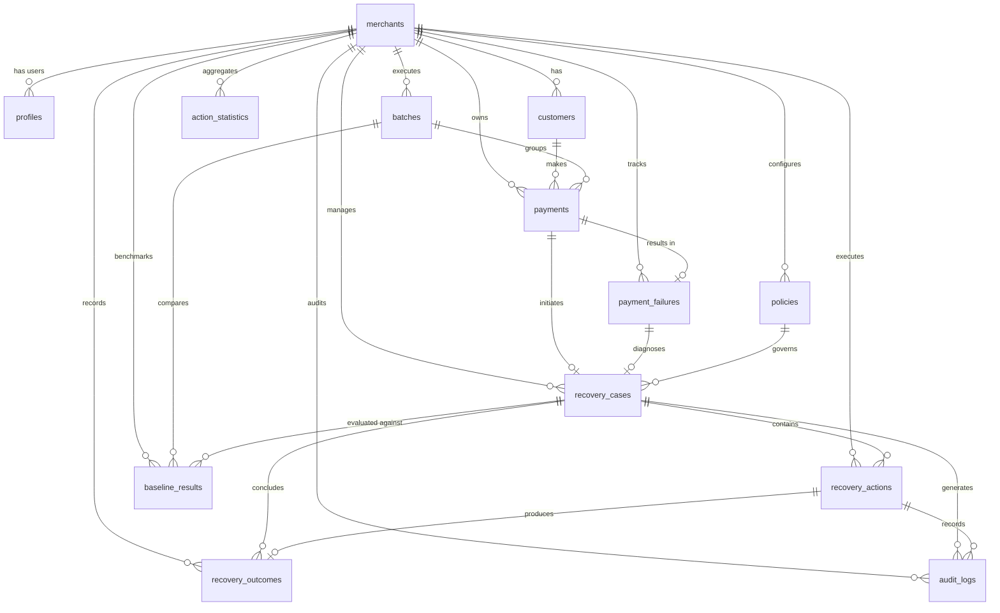

# RecoverIQ Architecture Specification

## Overview
RecoverIQ is an Adaptive AI Revenue Recovery Agent built for Razorpay Track 03. It specializes strictly in recovering failed and degraded payments through root cause diagnosis, adaptive policy selection, deterministic server-side guardrails, and verifiable outcome tracking.

## System Topology (Modular Monolith)

```
[ Merchant Web Console ] (React + TypeScript + Tailwind CSS)
           │
           │ Supabase Auth (JWT) / REST API
           ▼
[ FastAPI Backend Application ]
   ├── API Layer (/api/v1)
   ├── Auth Middleware (Supabase JWT Verification)
   ├── Diagnosis Service (Error & Gateway Classification)
   ├── Adaptive Policy Engine (Statistical Action Scoring)
   ├── Server-Side Guardrails (Deterministic Safety Limits)
   ├── Action Executor (Razorpay Sandbox / Simulator Adapter)
   └── Outcome Verifier & Audit Logger
           │
           ▼
[ Supabase PostgreSQL ] (RLS Enabled)
   ├── merchants (Multi-tenant root organization)
   ├── profiles (User identity & role-based access linked to auth.users)
   ├── customers (End customer identity & opt-out preferences)
   ├── batches (Benchmark/batch processing execution groups)
   ├── payments (Payment transaction records without sensitive card/CVV data)
   ├── payment_failures (Root cause diagnostic attributes & classifications)
   ├── policies (Guardrails, limits, cooldowns, and communication windows)
   ├── recovery_cases (V2 State Machine lifecycle tracking)
   ├── recovery_actions (Deterministic & adaptive action execution plans)
   ├── recovery_outcomes (Verifiable recovery outcome tracking)
   ├── action_statistics (Calibrated historical recovery success rates)
   ├── baseline_results (Benchmark comparison vs fixed strategies)
   └── audit_logs (Immutable audit trail of actions, decisions & overrides)
```

## Database Entity Relationships



## Core Recovery Actions & Execution Modes

### Action Types
1. `RETRY_NOW` — Immediate transient error retry (e.g., network glitch, momentary gateway timeout).
2. `RETRY_LATER` — Scheduled retry after gateway degradation or banking system cooldown.
3. `PAYMENT_UPDATE` — Prompt customer with smart fallback links (e.g. switch from failed NetBanking to UPI / Card).
4. `REMINDER` — Respectful customer notification sent via preferred communication channel within allowed windows.
5. `ESCALATE` — Flag for high-value manual merchant intervention and account manager review.
6. `STOP` — Explicit terminal state to prevent customer harassment, duplicate charges, or fraud retry.

### Execution Modes
- `RAZORPAY_TEST` — Integration testing against Razorpay Test mode API.
- `SIMULATION` — Controlled sandbox environment for high-throughput policy testing.
- `DRY_RUN` — Evaluates policies and guardrails without triggering external API calls.

## Recovery Case Lifecycle (V2 State Machine)

```
[ DETECTED ] ──► [ DIAGNOSED ] ──► [ DECISION_READY ] ──► [ APPROVED ]
                                                              │
   ┌──────────────────────────────────────────────────────────┴───────────────┐
   ▼                                                                          ▼
[ EXECUTING ] ──► [ WAITING ] ──► [ RECOVERED ] (Terminal Success)      [ ESCALATED ]
   │                 │
   │                 ├──► [ STOPPED ] (Terminal Guardrail)
   │                 │
   └─────────────────┴──► [ FAILED ] (Terminal Failure)
```

## Guardrail Rules & Boundaries
- Non-bypassable server-side enforcement on all recovery actions.
- Hard configurable limits (`max_retries`, `max_communications`) per recovery case.
- Mandatory cooldown periods between retry attempts.
- Time-of-day communication windows (e.g. 09:00 - 20:00) and opt-out enforcement.
- Strict data privacy: zero storage of card numbers, CVV, OTPs, or payment secrets.
- No direct LLM mutation of financial state or execution of external payment calls.
